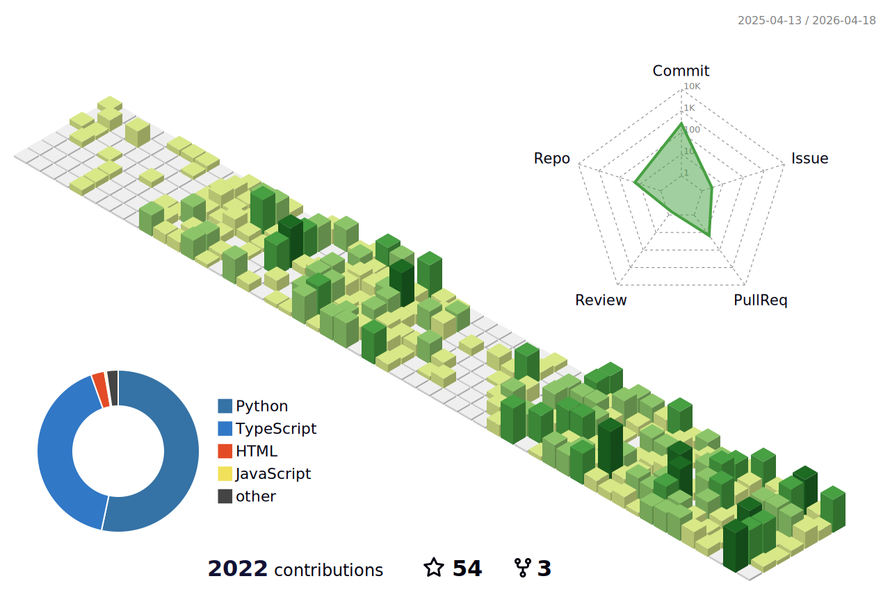

<h1 align="center">
  
</h1>

  

  <h2>About Me</h2>

  

    I'm a <b>Generative AI Engineer</b> with a strong interest in Deep Learning,
    Data Science, and building real-world GenAI systems.
    I enjoy integrating chatbots, APIs, and advanced ML pipelines using
    cost-effective and open-source tools.
  

  

    Outside tech, I’m deeply into music production, jamming with my guitar and friends and travelling.
  

---

<h2 align="center">🎯 Current Focus</h2>

<ul>
  <li>🔭 Portfolio: <a href="https://portfolio-rajatdisawal.vercel.app">portfolio-rajatdisawal.vercel.app</a></li>
  <li>🌱 Learning advanced AI, GenAI & data systems</li>
  <li>👯 Collaborating on <a href="https://litementorai.vercel.app">LiteMentorAI</a></li>
  <li>💬 Ask me about LLMs, LangChain, DL, Python, Django & ML</li>
  <li>📫 Reach me: <a href="mailto:kashewknutt@gmail.com">kashewknutt@gmail.com</a></li>
  <li>⚡ Fun fact: Music producer, guitarist, pianist & singer</li>
</ul>

---

<h2 align="center">📈 Contributions (3D)</h2>

  

---

<h2 align="center">GitHub Stats</h2>

 <!-- Center-align the following statistics -->
    

 <!-- Center-align the following statistics -->
    

 <!-- Center-align the following statistics -->
    

---

<h2 align="center">🤝 Connect With Me</h2>

  
  
  
  
  
  

