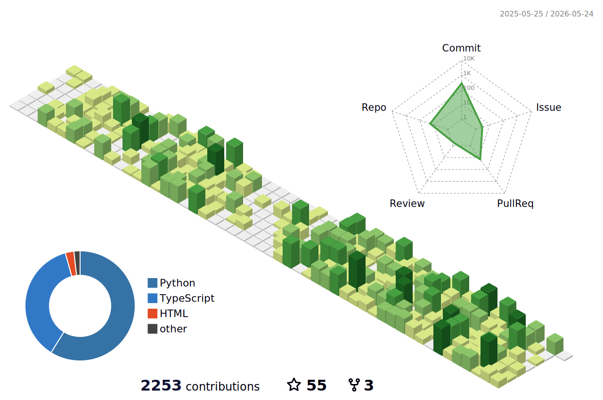
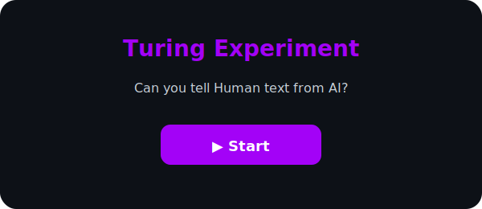

<h1 align="center">
  
</h1>

  

  About Me

  

    I'm a <b>Deep Learning Researcher</b> with a strong interest in Deep Learning,
    Data Science, and building real-world GenAI systems.
    I enjoy integrating chatbots, APIs, and advanced ML pipelines using
    cost-effective and open-source tools.
    I currently run a software solutions agency that helps non-tech founders as their tech backbone.
  

  

    Outside tech, I’m deeply into music production, jamming with my guitar and travelling.
  

  

<!-- <h2 align="center">Mini Game: AI or Human?</h2>

  

  Click an option to see if you guessed right :P
  This is a simple recreation of the Turing Experiment: Human or Not?

 -->

<h2 align="center">GitHub Analytics</h2>

 

  

  

<h2 align="center">Statistics</h2>

 

<h2 align="center">Connect With Me</h2>

  
  
  
  
  
  

